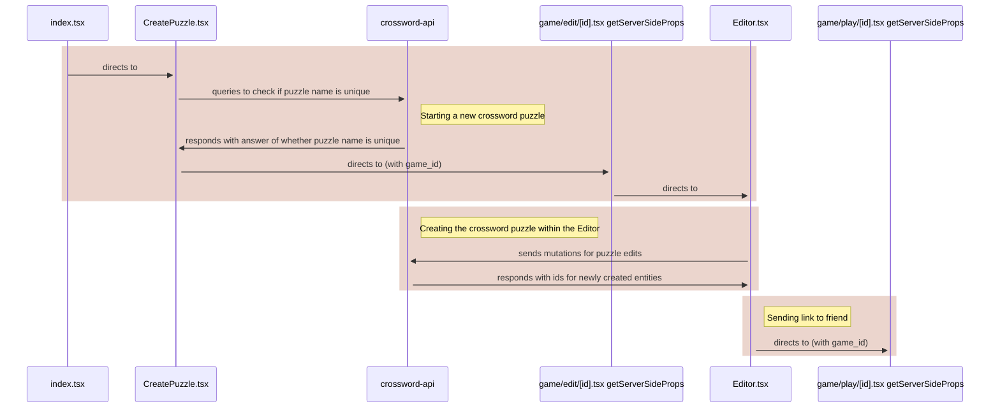
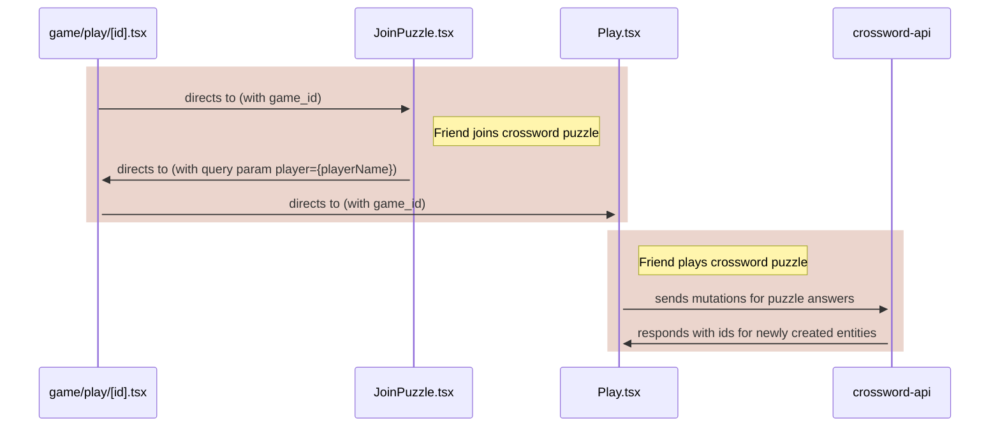
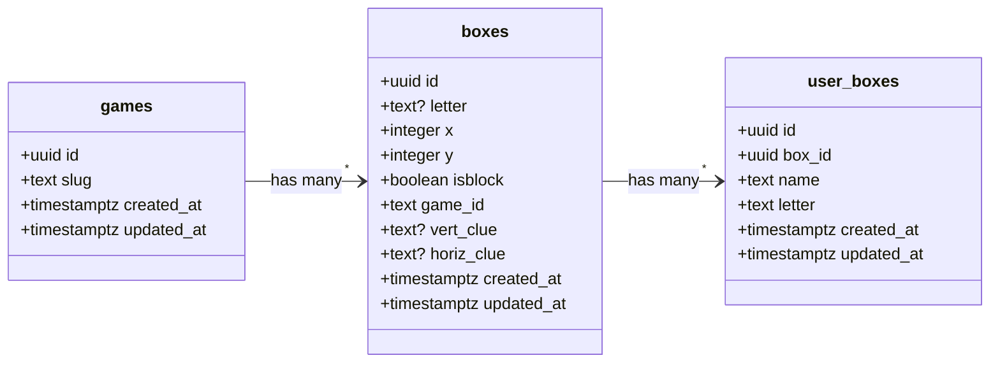

# Crossword Maker

# Table of Contents
- [Inspiration](#inspiration)
- [How to play](#how-to-play)
  - [Example](#example-of-a-frog-shaped-crossword)
- [Code Structure](#code-structure)
  - [Frontend](#frontend-typescript-react-tailwind-nextjs)
  - [Backend](#backend-typescript-nestjs)
  - [Database](#database-postgresql)

## Inspiration

For the last few months I got really into the New York Times Daily Mini. Its just a fun way for me to start my morning and wake my brain up in a few minutes.

One day, as I was trying to come up with a birthday present idea for a friend, I thought - "Wouldn't it be great to make them a personalized crossword puzzle of words related to our shared memories?"

And so, the idea for crossword maker was born - a web application that lets you create crossword puzzles and share them with friends to solve!

## How to play

First you will land on this page where you can enter the name of your puzzle. 
You have to check if the name has already been taken first.


Then you will be sent to the editor where you can construct your puzzle. 
There are a few key features when creating the crossword puzzle.

<table style="border-collapse: collapse;">
  <tr style="border: 10px transparent;">
    <td style="padding: 0; margin: 0">
      
    </td>
    <td style="padding: 0; margin: 0; text-align: center">
      <b>Creation</b>
      <br>
      <br>
      Go to create mode. To create new boxes 
      <br>
      first click on an existing box. Then the
      <br>
      neighboring boxes will appear. Then you can
      <br>
      select any of them to create new ones.
    </td>
  </tr>
  <tr style="border: 10px transparent;">
    <td style="padding: 0; margin: 0;">
      
    </td>
    <td style="padding: 0; margin: 0;">
      <b>Text</b>
      <br>
      <br>
      Go to text mode. Easily add text
      <br>
      to any box by selecting it and typing. 
      <br>
      You can replace any existing letter by 
      <br>
      selecting it and typing a new letter, so
      <br>
      there is no need for deleting, eventhough 
      <br>
      it is still possible.
    </td>
  </tr>
  <tr style="border: 10px transparent;">
    <td style="padding: 0; margin: 0;">
      
    </td>
    <td style="padding: 0; margin: 0;">
      <b>Deletion</b>
      <br>
      <br>
      Go to delete mode. You can delete any 
      <br>
      existing box by selecting on it.
    </td>
    </td>
  </tr>
  <tr style="border: 10px transparent;">
    <td style="padding: 0; margin: 0;">
      
    </td>
    <td style="padding: 0; margin: 0;">
      <b>Block</b>
      <br>
      <br>
      Go to block mode. You can create any 
      <br>
      block similar to any box. Select any 
      <br>
      existing box or block and you will 
      <br>
      see their neighbors. Select them to 
      <br>
      create them. 
    </td>
  </tr>
</table>

Once you are happy with the puzzle, you can select the Copy Link button and send it to a friend. They will have to enter their name and can start playing!


## Example of a frog shaped crossword

### Making the puzzle shape
Using all the features listed above, you can create puzzles of any shape!

https://github.com/dannygelman1/Crossword-Maker/assets/45411340/109afb4c-5174-44c3-81b6-a58fe68a11a6

### Setting the answers and clues
You can fill in the crossword with the answers and clues for your friend to solve.

https://user-images.githubusercontent.com/45411340/235391052-43d3b803-9e4c-4ada-978d-d87f599e21b5.mp4

### Sending the puzzle
You can copy the play link to send to you friend to play and they can check the puzzle as much as they want!

https://github.com/dannygelman1/Crossword-Maker/assets/45411340/0df8a28a-3e0f-4bc5-8a1c-417d1178f65a

## Code structure

This is shows the crossword creation flow:


This shows the sending to a friend and answering flow :

### Frontend (typescript, react, tailwind, Next.js)

My frontend is has 4 major pages: CreatePuzzle, Editor, JoinPuzzle, Play. 

- `CreatePuzzle` - this is where you enter the name of the crossword puzzle you want to create
- `Editor` - this is where you create the crossword puzzle
- `JoinPuzzle` - this is where your friend first lands when you send them the link to your puzzle, and where they can enter their name
- `Play` - this is where they can play your crossword puzzle

Each page uses queries and mutations from my `BoxService.ts`, which is a light wrapper for the GraphQL queries/mutations in `gqlClient.ts`

For example here is my getBoxes function in BoxService.ts:
```
export const getBoxes = async (id: string): Promise<getBoxesData> => {
  const boxesData = await gql.request<getBoxesData, getBoxesVariables>(
    GET_BOXES,
    {
      id,
    }
  );
  return boxesData;
};
```

And here is my `boxes` query in gqlClient.ts:
```
query boxes($id: String!) {
  boxes(id: $id) {
    id
    letter
    x
    y
    isblock
    vert_clue
    horiz_clue
  }
} 
```

### Backend (typescript, Nest.js)
My api is organized into games, boxes, and user_boxes:
 - `games` - each crossword puzzle is a `game`
 - `boxes` - each crossword puzzle is made of multiple `boxes`
 - `user_boxes` - each box can have multiple `user_boxes` associated with it, one for every new player's guess
 
Here are the queries and mutations:
- games
  - queries
    - findGame
  - mutations
    - createGame
- boxes
  - queries
    - box
    - boxes
  - mutations
    - createBox
    - updateBox
    - deleteBox
- user_boxes
  - queries
    - user_boxes
  - mutations
    - createUserBox
    - updateUserBox

### Database (PostgreSQL)

Here is how I store my data. 

 - `games` - each row corresponds to a new crossword puzzle game
 - `boxes` - each row corresponds to one box in one crossword puzzle.
 - `user_boxes` - each row corresponds to one player's answer to one box in one crossword puzzle.


 
